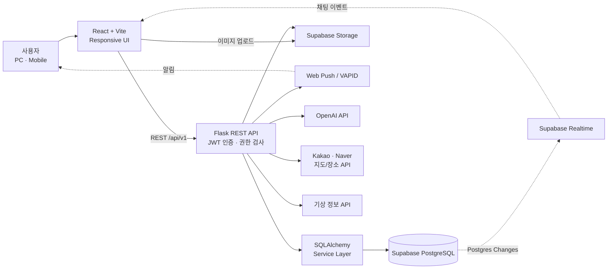

# SportsMate

> 위치와 관심 종목을 기반으로 운동 모임을 찾고, 함께 소통하고, 운영할 수 있는 스포츠 커뮤니티 플랫폼

SportsMate는 일회성·정기 운동 모임의 생성부터 참여 신청, 실시간 채팅, 일정 및 출석 관리까지 하나의 흐름으로 제공하는 웹 서비스입니다. 하나의 React 애플리케이션에서 PC와 모바일 UI를 분기하며, Flask REST API와 Supabase PostgreSQL을 중심으로 동작합니다.

## 주요 기능

### 모임 탐색 및 참여

- 제목·종목·지역 키워드 검색과 상세 필터
- 현재 위치 또는 지도에서 선택한 위치를 기준으로 한 반경 검색
- 일회성 모임과 반복 일정이 있는 정기모임 지원
- 다음 정기 회차를 기준으로 모임 노출 및 일정 표시
- 참여 신청, 방장 승인, 신청 취소와 정원 관리
- 모임 조회수, 후기, 공지와 투표

### 채팅 및 알림

- 모임 채팅과 사용자 간 1:1 채팅
- Supabase Realtime 기반 새 메시지 갱신
- 읽지 않은 메시지 수와 읽음 상태
- 답장, 이미지, 위치 공유와 메시지 신고
- 채팅방 상단 고정, 알림 끄기와 나가기
- 활동 중인 모임과 활동 종료된 모임 채팅방 분리
- Web Push 기반 서비스 알림

### 모임 운영

- 방장용 모임 대시보드
- 참여 신청자 승인·거절 및 멤버 관리
- 정기모임 회차 생성, 변경과 취소
- 공지 및 투표 생성
- QR 출석 체크와 수동 출석 처리
- 참여율과 모임 운영 통계

### AI 비서 및 생활 정보

- 사용자 선호 종목·지역을 반영한 모임 추천
- 현재 참여 중인 모임 일정 안내
- 자연어 기반 지역·종목 검색
- 현재 위치와 지정 지역의 날씨 안내
- OpenAI 응답 생성 실패 시에도 동작하는 규칙 기반 응답

### 계정 및 관리자

- 이메일, Google, Kakao 로그인
- 프로필, 선호 종목, 활동 지역과 자기소개 관리
- 계정 탈퇴 유예 및 복구 흐름
- 사용자·모임·신고·문의·공지 관리
- 서비스 통계, 일괄 알림, 감사 로그와 점검 모드

## 기술 스택

| 영역 | 기술 |
| --- | --- |
| Frontend | React 18, React Router, Vite, Axios |
| UI | CSS, Lucide React, Tabler Icons |
| Backend | Python 3.12, Flask 3, Flask-JWT-Extended |
| ORM | SQLAlchemy, Flask-SQLAlchemy |
| Database | PostgreSQL / Supabase |
| Realtime & Storage | Supabase Realtime, Supabase Storage |
| Push | Web Push, VAPID |
| External APIs | OpenAI, Kakao Local, Naver Maps/Search, 기상 API |
| Deployment | Docker, Nginx, Gunicorn, Vercel, Render, GitHub Actions |
| Test | Python unittest, Node.js test runner |

## 시스템 아키텍처



### 요청 흐름

1. React가 `/api/v1` 경로로 Flask API를 호출합니다.
2. Flask는 JWT와 사용자 권한을 확인한 뒤 서비스 계층에서 비즈니스 규칙을 처리합니다.
3. SQLAlchemy가 Supabase PostgreSQL의 사용자, 모임, 채팅, 출석 데이터를 조회·변경합니다.
4. 채팅 INSERT 이벤트는 Supabase Realtime을 통해 클라이언트에 전달됩니다.
5. Realtime 연결이 불안정할 때는 화면 활성 상태에 따라 보조 폴링이 동작합니다.

## 프로젝트 구조

```text
sportsmate/
├─ frontend/                   # React 클라이언트
│  ├─ public/                 # 정적 이미지, PWA 및 서비스 워커 파일
│  ├─ src/
│  │  ├─ api/                 # Axios API 모듈, Supabase 클라이언트
│  │  ├─ components/
│  │  │  ├─ admin/            # 관리자 UI
│  │  │  ├─ chat/             # 모임/1:1 채팅
│  │  │  ├─ chatbot/          # AI 비서
│  │  │  ├─ meeting/          # 모임 목록·상세·생성
│  │  │  ├─ profile/          # 내 정보와 프로필
│  │  │  └─ ...               # 홈, 일정, 알림, 지도 등
│  │  ├─ contexts/            # 인증 등 전역 상태
│  │  ├─ hooks/               # 반응형 분기와 공통 Hook
│  │  ├─ layouts/             # PC·모바일·관리자 레이아웃
│  │  ├─ pages/               # 라우트 단위 페이지
│  │  ├─ routes/              # React Router 설정
│  │  ├─ styles/              # 공통·PC·모바일 스타일
│  │  └─ utils/               # 일정, 이미지, 알림 등의 유틸리티
│  ├─ tests/                  # 프론트 정책 및 유틸리티 테스트
│  └─ vite.config.js
├─ backend/                    # Flask API 서버
│  ├─ app/
│  │  ├─ models/              # SQLAlchemy 모델
│  │  ├─ routes/              # REST API Blueprint
│  │  ├─ services/            # 인증·모임·채팅·날씨 비즈니스 로직
│  │  └─ utils/               # 시간대, 설정, 정책 유틸리티
│  ├─ sql/                    # 운영 DB 보완 SQL
│  ├─ tests/                  # API·권한·정합성 테스트
│  ├─ config.py               # 환경 변수와 DB 연결 설정
│  └─ run.py                  # Flask 애플리케이션 진입점
├─ api/index.py               # Vercel Python 함수 진입점
├─ .github/workflows/         # CI/CD 워크플로
├─ docker-compose.yml         # 프론트·백엔드 컨테이너 구성
├─ Dockerfile                 # Nginx + Gunicorn 통합 이미지
├─ vercel.json                # Vercel 빌드 및 Rewrite 설정
└─ package.json               # 로컬 통합 실행 스크립트
```

## 핵심 데이터 모델

| 도메인 | 주요 모델 |
| --- | --- |
| 사용자 | `User`, `UserProfile` |
| 종목·지역 | `SportCategory`, `Sport`, `Region` |
| 모임 | `Meeting`, `MeetingSession`, `Participant`, `MeetingView` |
| 채팅 | `ChatRoom`, `ChatMessage`, `ChatMessageRead`, `DirectChatRoom`, `DirectChatMessage` |
| 운영 | `Notice`, `Vote`, `Attendance`, `AttendanceCheckinWindow`, `Review` |
| 알림·신고 | `Notification`, `PushSubscription`, `Report`, `SupportInquiry` |
| AI 비서 | `ChatbotSession`, `ChatbotMessage`, `ChatbotUserMemory` |

## 로컬 실행

### 요구 사항

- Node.js 22 권장
- Python 3.12
- PostgreSQL 또는 Supabase 프로젝트

### 1. 저장소 및 패키지 준비

```bash
git clone https://github.com/sagwajusu/sportsmate.git
cd sportsmate

npm install
npm run install:frontend
```

Python 가상환경과 백엔드 패키지를 설치합니다.

```bash
python -m venv backend/.venv
backend/.venv/Scripts/python -m pip install -r backend/requirements.txt
```

macOS/Linux에서는 마지막 명령의 Python 경로를 `backend/.venv/bin/python`으로 바꿉니다.

### 2. 환경 변수 설정

`backend/.env.example`을 복사해 `backend/.env`을 만들고 실제 키를 입력합니다.

```bash
cp backend/.env.example backend/.env
```

프론트엔드에는 `frontend/.env` 파일을 만듭니다.

```env
VITE_DEV_HOST=0.0.0.0
VITE_DEV_PORT=5173
VITE_API_BASE_URL=/api/v1
VITE_API_PROXY_TARGET=http://127.0.0.1:5002
VITE_SUPABASE_URL=https://<project-ref>.supabase.co
VITE_SUPABASE_ANON_KEY=<anon-or-publishable-key>
VITE_QR_PUBLIC_ORIGIN=
```

백엔드의 필수 항목은 다음과 같습니다.

```env
FLASK_RUN_HOST=0.0.0.0
FLASK_RUN_PORT=5002
FRONTEND_ORIGIN=http://localhost:5173,http://localhost:5174
DATABASE_URL=postgresql://postgres.<project-ref>:<password>@<pooler-host>.supabase.com:5432/postgres?sslmode=require
JWT_SECRET_KEY=<32바이트 이상의 안전한 값>
SUPABASE_URL=https://<project-ref>.supabase.co
SUPABASE_ANON_KEY=<anon-or-publishable-key>
SUPABASE_SERVICE_ROLE_KEY=<service-role-or-secret-key>
```

지도, 날씨, AI 비서와 푸시 알림은 해당 기능을 사용할 때 관련 API 키가 추가로 필요합니다. 전체 목록은 [`backend/.env.example`](backend/.env.example)을 참고하세요.

### 3. 개발 서버 실행

Windows 환경에서는 루트 명령 하나로 백엔드, PC, 모바일 개발 서버를 실행할 수 있습니다.

```bash
npm run dev
```

| 구분 | 기본 주소 |
| --- | --- |
| PC | `http://localhost:5173` |
| Mobile Preview | `http://localhost:5174/?device=mobile` |
| Backend | `http://localhost:5002` |
| Health Check | `http://localhost:5002/api/health` |

개별 실행도 가능합니다.

```bash
npm run dev:backend
npm run dev:pc
npm run dev:mobile
```

> `flask --app run.py init-db`는 기존 테이블을 삭제한 뒤 다시 생성합니다. 운영 DB나 보존할 데이터가 있는 DB에서는 실행하지 마세요.

## 테스트 및 빌드

백엔드 테스트:

```bash
cd backend
.\.venv\Scripts\python.exe -m unittest discover -s tests
```

프론트 정책·유틸리티 테스트:

```bash
cd frontend
node --test tests/*.test.cjs
```

프로덕션 빌드:

```bash
npm run build
```

## 배포

### Docker

루트 `Dockerfile`은 React를 빌드한 뒤 Nginx로 정적 파일을 제공하고, 같은 컨테이너에서 Gunicorn으로 Flask를 실행합니다. Nginx는 `/api/` 요청을 Gunicorn으로 프록시합니다.

```bash
docker build -t sportsmate .
docker run --env-file backend/.env -p 80:80 sportsmate
```

### Vercel

- `frontend/dist`를 정적 프론트엔드로 배포합니다.
- SPA 경로는 `index.html`로 Rewrite합니다.
- 루트 설정에는 `/api/*` 요청을 `api/index.py`의 Flask 애플리케이션으로 전달하는 구성이 포함되어 있습니다.
- 현재 프론트엔드의 운영 기본 API 주소는 `frontend/src/api/client.js`에 설정된 Render 백엔드입니다.
- Supabase, JWT, 외부 API 키는 Vercel 프로젝트 환경 변수로 등록해야 합니다.

### GitHub Actions / Oracle

`main` 브랜치에 Push되면 `.github/workflows/deploy.yml`이 Oracle 서버에 SSH로 접속해 `/var/www/sportsmate/deploy.sh`를 실행합니다. 저장소 Secret에 `ORACLE_HOST`, `ORACLE_USER`, `ORACLE_SSH_KEY`가 필요합니다.

## API 구성

모든 주요 API는 `/api/v1` 아래에 있습니다.

| Prefix | 역할 |
| --- | --- |
| `/auth` | 회원가입, 로그인, 소셜 인증 |
| `/users` | 사용자 및 프로필 |
| `/meetings` | 모임, 회차, 참여, 출석 |
| `/chatrooms` | 모임·1:1 채팅 |
| `/chatbot` | AI 비서 대화와 추천 |
| `/weather` | 날씨 조회 |
| `/reports` | 신고 |
| `/support` | 고객 문의 |
| `/admin` | 관리자 기능 |

## 참고 사항

- PC와 모바일은 별도 애플리케이션이 아니라 `ResponsivePage`와 반응형 Hook을 통해 화면 컴포넌트를 선택합니다.
- 백엔드 시간 계산은 한국 표준시(KST)를 기준으로 처리합니다.
- Supabase 서비스 역할 키와 외부 API 비밀키는 프론트엔드 환경 변수에 넣지 마세요.
- 루트 `app.py`는 이전 정적 HTML 확인용 서버이며 현재 기본 개발 흐름은 React + Flask입니다.
